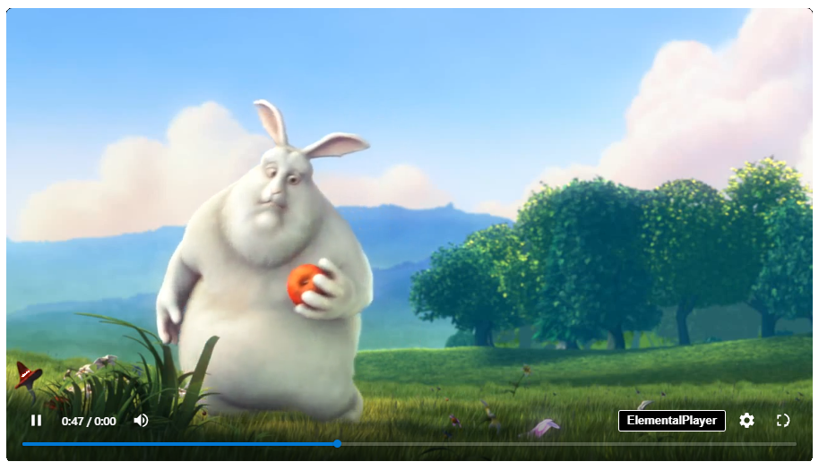

# ElementalPlayer

ElementalPlayer é um player de vídeo moderno, leve e personalizável para websites. Com uma interface elegante e recursos avançados, ele oferece uma experiência excepcional de reprodução de vídeo.



## Índice

- [Recursos](#recursos)
- [Instalação](#instalação)
- [Uso Básico](#uso-básico)
- [Configurações Avançadas](#configurações-avançadas)
- [Personalização](#personalização)
- [API](#api)
- [Exemplos](#exemplos)
- [FAQ](#faq)

## Recursos

- Interface moderna e responsiva
- Controle de qualidade do vídeo
- Controle de volume com memória
- Controles de mídia intuitivos
- Atalhos de teclado
- Suporte a dispositivos móveis (touch)
- Modo tela cheia
- Suporte a legendas
- Suporte a múltiplas faixas de áudio
- Personalização de cores e estilos

## Instalação

1. Faça o download dos arquivos do ElementalPlayer:
   - `player.js`

2. Adicione o script ao seu projeto:

```html
<script src="player.js"></script>
```

## Uso Básico

1. Adicione a tag de vídeo ao seu HTML:

```html
<video src="seu-video.mp4" controls></video>
```

2. O ElementalPlayer será inicializado automaticamente para todas as tags de vídeo na página.

### Exemplo Básico

```html
<!DOCTYPE html>
<html>
<head>
    <title>ElementalPlayer - Exemplo Básico</title>
</head>
<body>
    <video src="video.mp4" controls></video>
    <script src="player.js"></script>
</body>
</html>
```

## Configurações Avançadas

### Múltiplas Qualidades de Vídeo

Para oferecer diferentes qualidades de vídeo, use o atributo `data-qualities`:

```html
<video 
    src="video-720p.mp4" 
    data-qualities='{
        "1080": "video-1080p.mp4",
        "720": "video-720p.mp4"
    }'
    controls>
</video>
```

### Legendas

Adicione legendas usando a tag `track`:

```html
<video src="video.mp4" controls>
    <track 
        label="Português" 
        kind="subtitles" 
        srclang="pt" 
        src="legendas-pt.vtt" 
        default>
    <track 
        label="English" 
        kind="subtitles" 
        srclang="en" 
        src="legendas-en.vtt">
</video>
```

## Personalização

### Cores

O ElementalPlayer usa variáveis CSS para personalização de cores:

```css
.video-container {
    --primary-color: #2196F3;      /* Cor principal */
    --text-color: #ffffff;         /* Cor do texto */
    --background-color: #000000;   /* Cor de fundo */
}
```

### Estilos das Legendas

Personalize o estilo das legendas através do menu de configurações ou via CSS:

```css
.video-container .subtitles {
    font-family: Arial;
    font-size: 16px;
    color: white;
    text-shadow: 2px 2px 2px black;
}
```

## API

### Métodos

```javascript
const player = new ElementalPlayer(videoElement);

// Controles de Reprodução
player.togglePlay();       // Alterna entre play/pause
player.skip(seconds);      // Avança/retrocede o vídeo
player.changeVolume(0.5);  // Altera o volume (0-1)

// Qualidade do Vídeo
player.switchQuality('720'); // Muda a qualidade do vídeo

// Tela Cheia
player.toggleFullscreen(); // Alterna modo tela cheia
```

### Eventos

O ElementalPlayer mantém todos os eventos nativos do elemento `video` e adiciona alguns próprios:

```javascript
video.addEventListener('qualitychange', (e) => {
    console.log('Qualidade alterada para:', e.detail.quality);
});
```

## Exemplos

### Player com Todas as Opções

```html
<video 
    src="video-720p.mp4" 
    data-qualities='{
        "1080": "video-1080p.mp4",
        "720": "video-720p.mp4"
    }'
    poster="thumbnail.jpg"
    controls>
    <track 
        label="Português" 
        kind="subtitles" 
        srclang="pt" 
        src="legendas-pt.vtt" 
        default>
</video>
```

### Personalização Completa

```html
<style>
.meu-player {
    --primary-color: #ff0000;
    --text-color: #ffffff;
    --background-color: #000000;
}

.meu-player .subtitles {
    font-family: 'Roboto', sans-serif;
    font-size: 20px;
    font-weight: bold;
}
</style>

<video class="meu-player" src="video.mp4" controls></video>
```

## Atalhos de Teclado

| Tecla          | Ação                    |
|----------------|-------------------------|
| Espaço/K       | Play/Pause             |
| M              | Mudo                   |
| F              | Tela Cheia             |
| ←              | Retroceder 5s          |
| →              | Avançar 5s             |
| ↑              | Aumentar Volume        |
| ↓              | Diminuir Volume        |

## FAQ

### Como adicionar múltiplas qualidades de vídeo?
Use o atributo `data-qualities` com um objeto JSON contendo as qualidades disponíveis:
```html
<video 
    src="720p.mp4" 
    data-qualities='{
        "1080": "1080p.mp4",
        "720": "720p.mp4"
    }'
    controls>
</video>
```

### Como personalizar as cores do player?
Use variáveis CSS na classe `.video-container`:
```css
.video-container {
    --primary-color: #your-color;
}
```

### Como adicionar legendas?
Use a tag `track` dentro da tag `video`:
```html
<video src="video.mp4" controls>
    <track label="Português" kind="subtitles" src="legendas.vtt">
</video>
```

### O player suporta vídeos HLS/DASH?
Atualmente, o ElementalPlayer suporta apenas formatos de vídeo nativamente suportados pelo navegador (MP4, WebM, etc.).

## Contribuindo

O ElementalPlayer é um software proprietário. Não são aceitas contribuições externas no momento.

## Licença

ElementalPlayer é um software proprietário protegido por direitos autorais. Todos os direitos reservados.

O uso do ElementalPlayer está sujeito aos termos da [Licença Proprietária do ElementalPlayer](LICENSE).

### Permissões:
✅ Usar em projetos comerciais e não-comerciais
✅ Personalizar a aparência usando variáveis CSS oficiais
✅ Integrar em websites e aplicações

### Restrições:
❌ Modificar o código-fonte
❌ Criar trabalhos derivados
❌ Realizar engenharia reversa
❌ Redistribuir o software
❌ Remover ou alterar a marca ElementalPlayer

---

Desenvolvido com ❤️ para criar a melhor experiência de vídeo na web.
